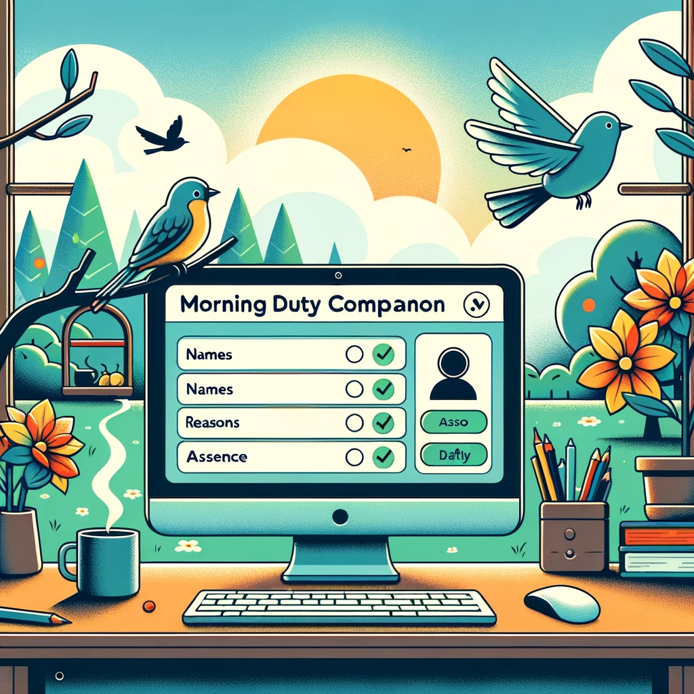

# ☀️ Morning Duty Companion ☀️

Morning Duty Companion is a simple website designed to assist RIB RAs with RIB routine morning duty.

## 🚀 **Features**

- Easily manage and track absent boarders
- Select names and reasons from dropdown menus or enter custom values.
- Automatically generate messages to be sent to the Boarding Managers.
- Display the list of names and reasons in a table format.
- Remove entries from the table with a single click.
- Interactive GUI.

## 💻 **Usage**

1. Open the [Morning Duty Companion](https://mdc.zyf.ninja/) website.
2. Please refer to the [User Guide](https://yufannnn.github.io/MorningDutyCompanion/) for detailed instructions on how to use the website. The user guide provides step-by-step explanations and screenshots to help you get started with the application.

## 🔧 **Technologies Used**

- HTML
- CSS
- JavaScript
- Tailwind CSS Framework

## 📝 **Note**

MorningDutyCompanion is an ongoing project and may have potential bugs and feature limitations. Please don't solely rely on its results at the current stage.

Your feedback and suggestions are greatly appreciated. If you encounter any issues or have ideas for improvement, please feel free to contact me.

🎉 Enjoy using MorningDutyCompanion to simplify your morning-duty management tasks!
