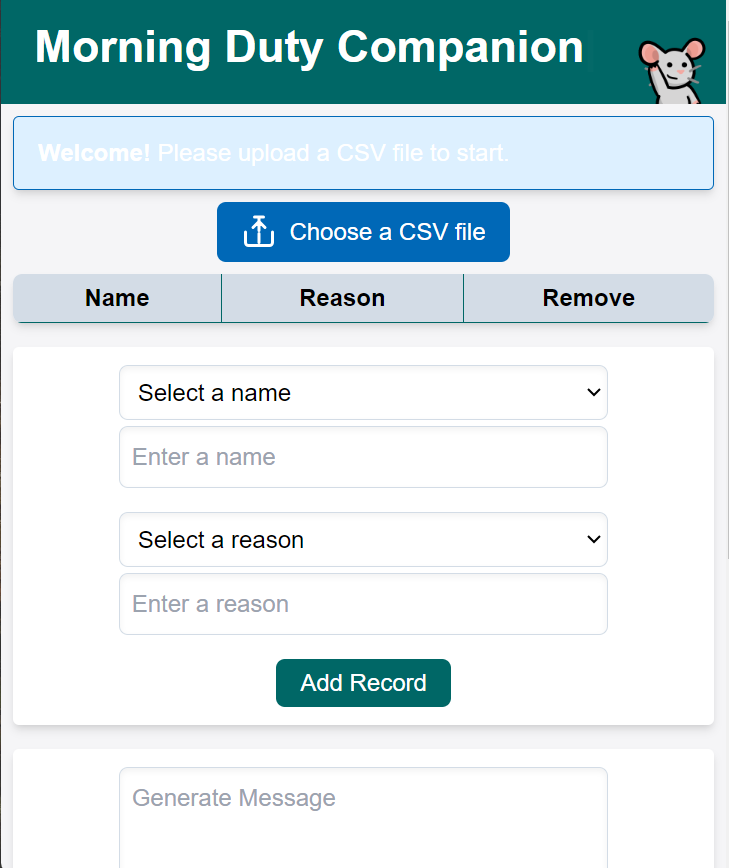
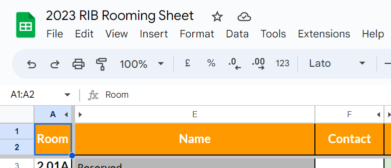
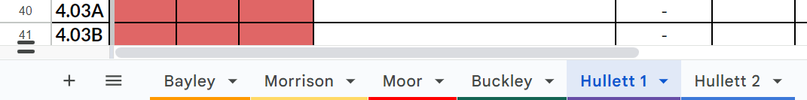
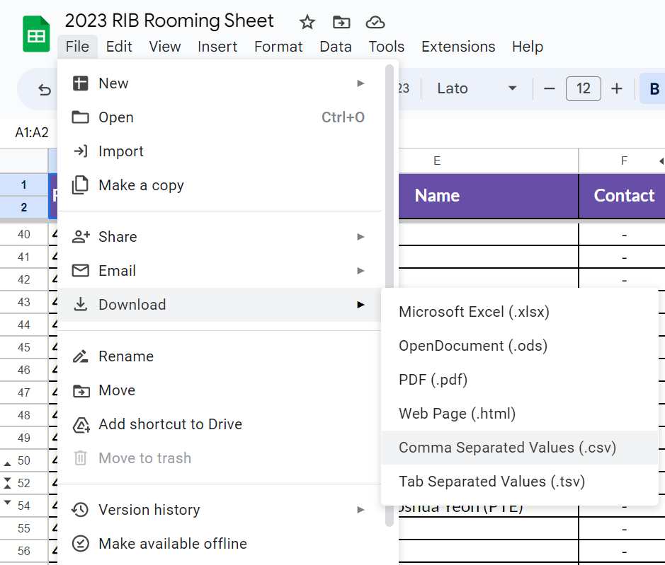
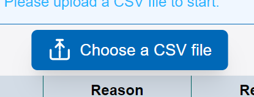
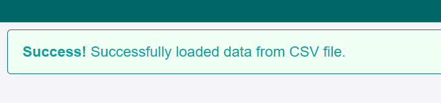
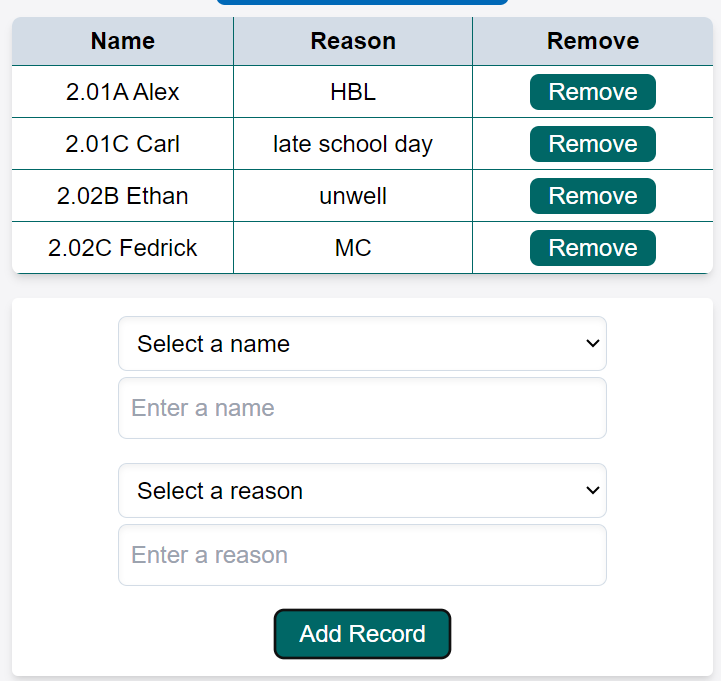
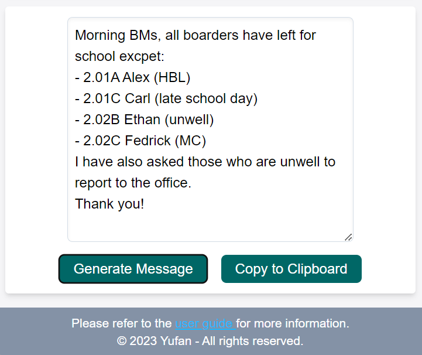

MorningDutyCompanion is a simple Web application designed to assist RIB RAs with RIB routine morning duty.

##  User Guide

### Step 1: Save Room List Data from Tutor Resource Folder

1. go to RIB Tutor shared Google folder

2. Open the most recent Room List

   

3. Navigate to the desired block's data.
   

   (Hullett 1 Block is Selected in this case)

4. Navigate to the save menu, and save the data as a csv file

   

### Step 2: Open the website

1. Open the website using this [link](https://mdc.zyf.ninja/)

### Step 3: Upload Room List 

1. Upload Desired Room List using the `Choose a CSV File` button.

   

2. If the file is successfully uploaded and recognized by the CSV File, you will see an Success Alert.

   

3. If your are doing duty for more than one block, simple add another List. The room data of the new block to be append to the back of the current name list.

### Step 4: Add A Boarder Record

1. Select or Enter the Name of a boarder. For Consistency purpose, when you enter a name that is not in the dropdown list, add the room number of that particular boarder at the front.

2. Select or Enter the reason for not going to school. 

3. The Algorithm Prioritize Self Entered Values rather than selected vals. If you both select and enter a value for name or reaons, the entered value will be chosen.

4. Click Add after filling in the Name and Reason, a record will be shown on the Record table above.

5. If you want to delete any added record, simple click the remove button associated with the record.

   

### Step 5: Generate Message

1. When you finished add all the records for today, click `Generate Message` button to generate the message to be sent to the BMs

2. You can also easily copy the message using the `copy to clipboard` button.

   

3.  The Message text are are editable, feel to make necessary changes before you copy and sent to the BMs. 

## More to Come:

1. More Customizable Generated Message:
2. Further UI Beautification: 
3. And more … 

## Disclaimer

Please note that this project has not undergone rigorous testing and may contain potential bugs and feature flaws. If you encounter any issues or have suggestions for improvements, please kindly contact me or simply raise an issue in the Issue Tracker of this Repo. Thank you for your understanding!

Enjoy!
